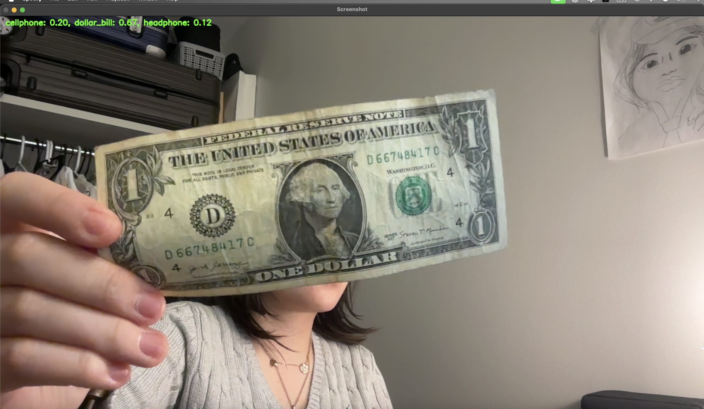
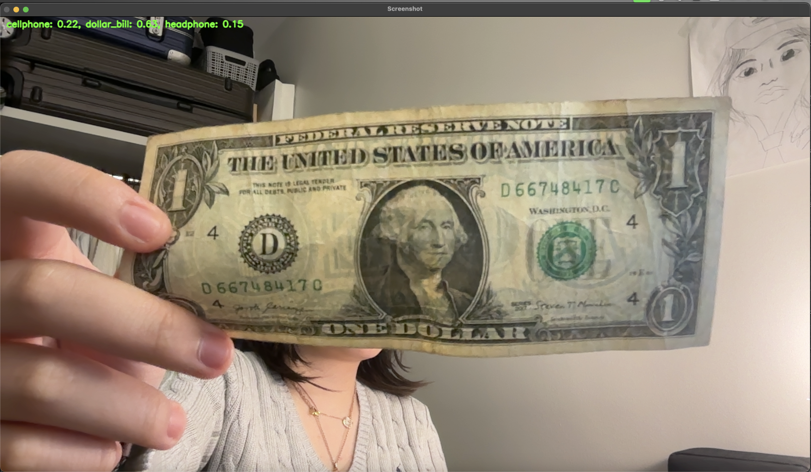

    # Experiment Results

## Task 1-3: General Identification

### General Identification for Dollar Bill, Cell Phone, and Headphone:

In general, the model works well in identifying the objects correctly. However, when there was a distraction (e.g., a dollar bill photo on my cell phone), the model got distracted and mistakenly identified it as a dollar bill.

### Task3: 
The model doesn't work as efficienlt when there are more categories this may be due to similar in feature when they are being extracted

### Analogies between Connected CNN Codes and SVM Kernels:

Using the dollar bill example, the output shows that fc1 and kernel linear work the best. This can be explained by better feature representation from fc1 compared to fc2 (e.g., fc1 captures more suitable features compared to fc2), and the data from these three classes are linearly distributed. Hence, the choice of a linear kernel yields better results.

## Task 4: 

### Model Used: LeNet-18 Model with Residual Neural Network

I used a LeNet-18 model that implements a residual neural network.

